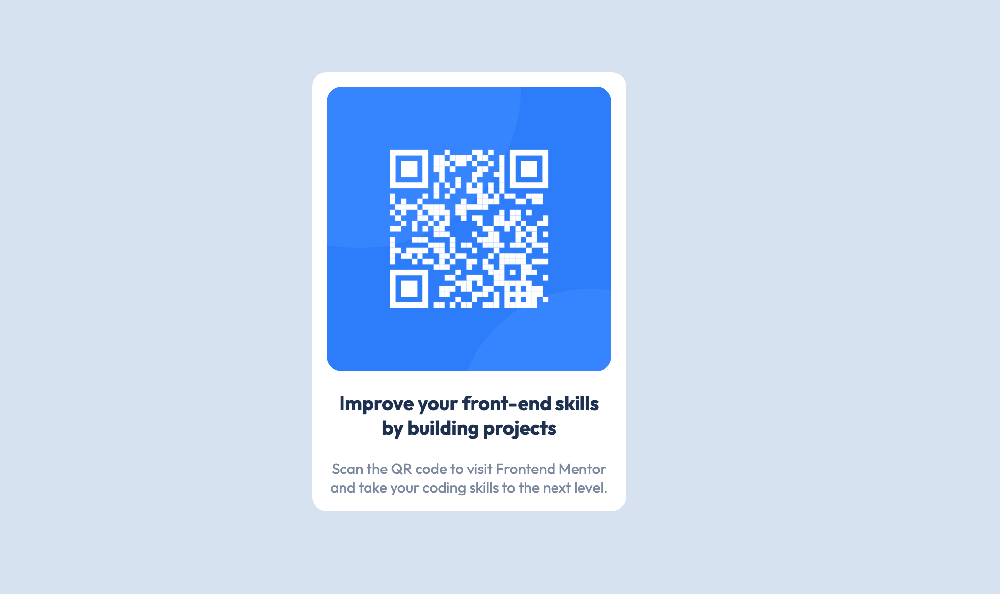

# Frontend Mentor - QR code component solution

This is a solution to the [QR code component challenge on Frontend Mentor](https://www.frontendmentor.io/challenges/qr-code-component-iux_sIO_H). Frontend Mentor challenges help you improve your coding skills by building realistic projects. 

## Table of contents

- [Overview](#overview)
  - [Screenshot](#screenshot)
  - [Links](#links)
- [My process](#my-process)
  - [Built with](#built-with)
  - [What I learned](#what-i-learned)
  - [Continued development](#continued-development)
  - [Useful resources](#useful-resources)
- [Author](#author)

## Overview

### Screenshot

This is the desktop view of the site.

### Links

- Solution URL: [Add solution URL here](https://your-solution-url.com)
- Live Site URL: [Add live site URL here](https://your-live-site-url.com)

## My process

### Built with

- HTML5
- CSS

### What I learned

Doing away with old 62.5% rem font hack, used calc() instead.

### Continued development

I will still be focusing on Angular. I am just trying to keep up with the latest developments in frontend and its best practices. Although I am doing Angular professionally, eventually I plan to learn React as there is a transition of projects towards this skill as well.

### Useful resources

- [A Complete Guide to Custom Properties](https://css-tricks.com/a-complete-guide-to-custom-properties/) - This site never rans out of simple to understand and useful resources. I like the brevity and straightforwardness of their articles. This is just one of them. Most of their articles also doubles up as a cheat sheets.

## Author

- Frontend Mentor - [@yourusername](https://www.frontendmentor.io/profile/ladyprogrammer)

